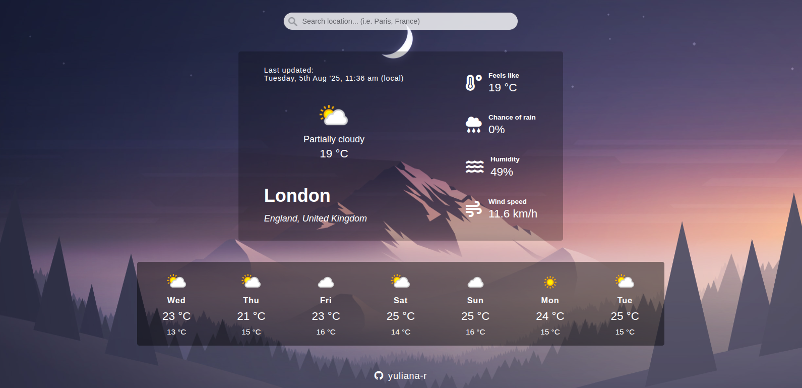

# Weather App
## Introduction

This project is an app that displays current weather and weekly forecast for any location in the world. It is built using the standard front-end stack of HTML, CSS, and JavaScript.

The project primarily demonstrates use of asynchronous JS with APIs, including the Fetch API, promises, and async/await syntax, as well as Webpack as module bundler and external libraries.

## Preview

## Media & assets credits:

1. Flaticon (iconixar): https://www.flaticon.com/free-icons/sun

2. WallpaperAccess: https://wallpaperaccess.com/minimalist-mountain